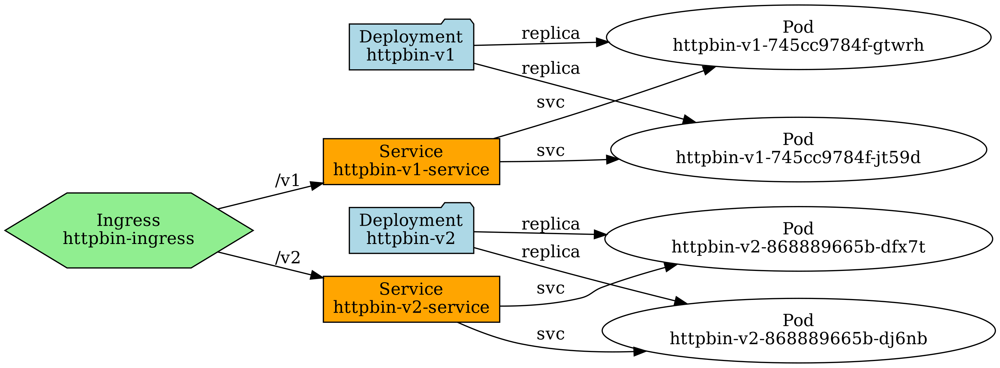

# Description

Python script to visualize the structure of a Kubernetes cluster or a specific namespace as a graph, including Deployments, Pods, Services, Ingresses, and other resources.

## Scenario

Use the [httpbin-kubernetes.yaml](httpbin-kubernetes.yaml) file to create 1 Ingress, 2 Services, and 2 ReplicaSets (4 Pods in total) running httpbin

### Create namespace
``` 
kubectl create namespace httpbin 
```
### Set context 
``` 
kubectl config set-context --current --namespace=httpbin
```
### Apply [httpbin-kubernetes.yaml](httpbin-kubernetes.yaml)
``` 
kubectl apply -f httpbin-kubernetes.yaml
```

# Libraries

### Add kubernetes and graphviz libraries using pip
``` 
pip install kubernetes
pip install graphviz
``` 

# Install Graphviz itself (provides the dot executable)

## Ubuntu/Debian

``` 
sudo apt-get update
sudo apt-get install graphviz
``` 

# Fedora/CentOS/RHEL

``` 
sudo dnf install graphviz
``` 

# macOS (Homebrew)

``` 
brew install graphviz
``` 

# Run
``` 
python3 kubernetes-graph.py -n httpbin -o kubernetes-cluster
``` 
# Result

